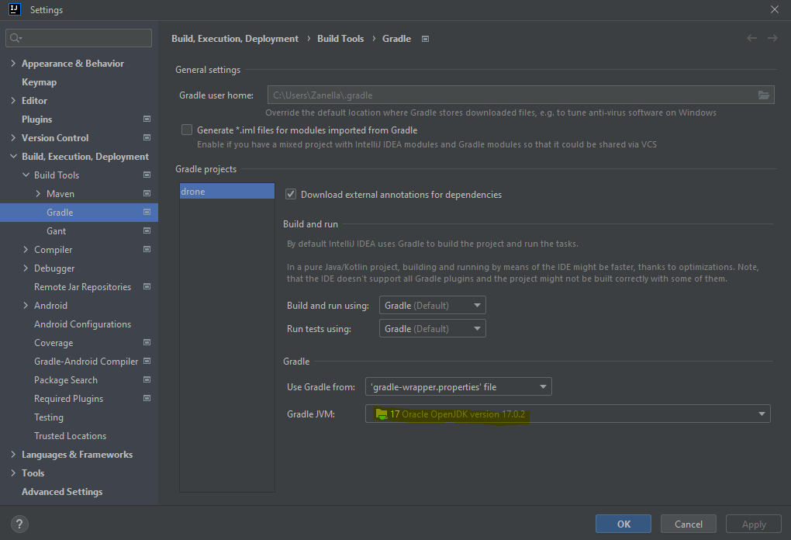
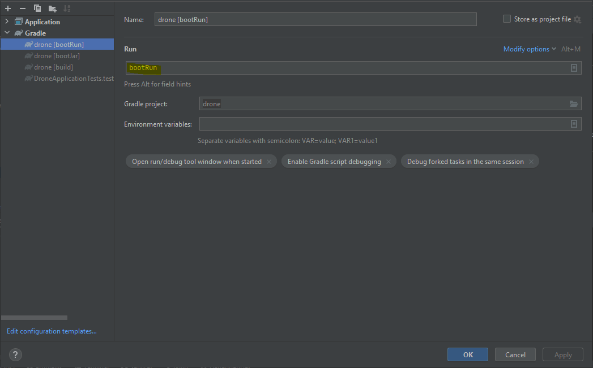

# DRONE APP

---

## OVERVIEW

---

### GRUPO

- RM346315: Lais Kagawa
- RM346511: Jônatha Lacerda Gonzaga
- RM346958: Thiago de Souza Zanella
- <del> RM347277: Gustavo de Oliveira Freitas</del> (Desistiu do curso)

---

### REPOSITÓRIOS RELACIONADOS

- https://github.com/zanella86/producer
- https://github.com/jhowlacerda/consumer

---

### FERRAMENTAS DE INTEGRAÇÃO

- Slack
- Github
- Trello

---

## PARA TESTAR

### Configure o ambiente

#### Versão do Java

#### Execução com o spring boot/gradle (chamada simples)

#### Execução com o script "cockpit" (chamadas múltiplas)
- Verifique os procedimentos neste [link](cockpit/README.md)

---

#### REFERÊNCIAS

- [HTTP Client - POST Request](https://www.baeldung.com/httpclient-post-http-request)
- [Convert a String into JSON Object](https://www.educative.io/answers/different-ways-to-convert-a-json-string-to-a-json-object-in-java)
