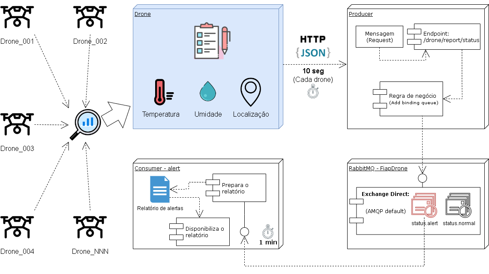

# DRONE APP

---

## OVERVIEW

---

### GRUPO

- RM346315: Lais Kagawa
- RM346511: Jônatha Lacerda Gonzaga
- RM346958: Thiago de Souza Zanella
- <del> RM347277: Gustavo de Oliveira Freitas</del> (Desistiu do curso)

---

### REPOSITÓRIOS RELACIONADOS

- https://github.com/zanella86/producer

---

### FERRAMENTAS DE INTEGRAÇÃO

- Slack
- Github
- Trello

---

## PARA TESTAR

#### FONTES

- https://www.baeldung.com/httpclient-post-http-request
- https://www.educative.io/answers/different-ways-to-convert-a-json-string-to-a-json-object-in-java
