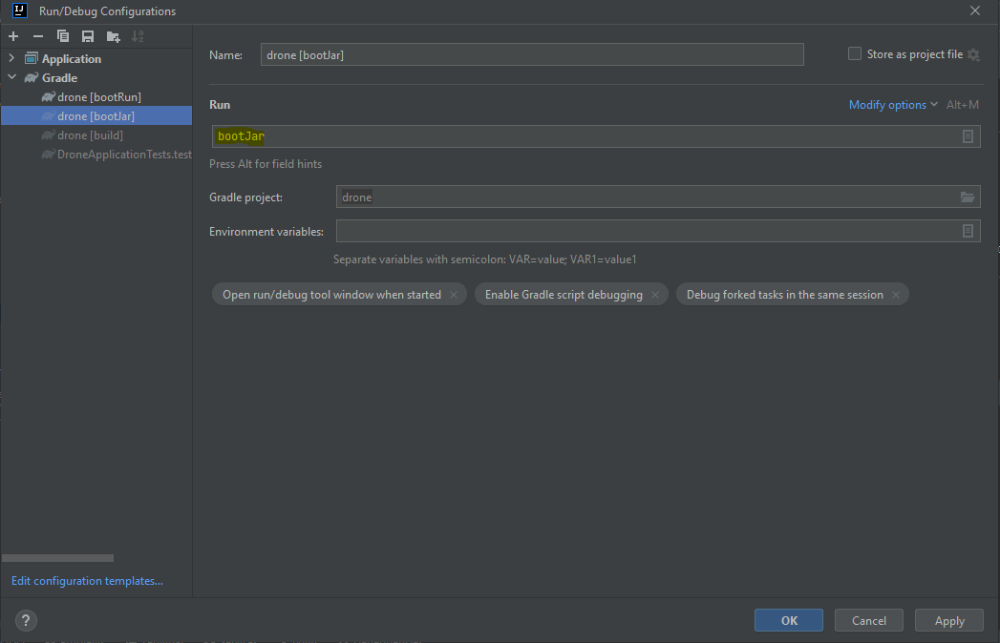

# COCKPIT

---

## Como gerar o pacote



---

## Como configurar o cockpit

1. Caso necessário, copie o JAR gerado anteriormente no diretório `/cockpit/app`
2. No arquivo `/cockpit/config/config.env`, configure:
   1. A versão do java/JRE no parâmetro `JAVA_HOME`; 
   2. A versão do aplicativo/JAR no parâmetro `DRONE_BIN`;
   3. Endereço do aplicativo [Producer](https://github.com/zanella86/producer) no parâmetro `PRODUCER_URL`.

---

## Como utilizar o cockpit
>**Importante:** É necessário utilizar um terminal de comando com suporte aos comandos _unix-like_. Exemplo: Terminal do Git.
1. Após efetuar as configurações, basta executar o comando ```bash start.sh```
   1. Os parâmetros solicitados, são:
      1. Quantidade de drones ativos (com rastreabilidade LIGADA);
      2. Quantidade de drones inativos (com rastreabilidade DESLIGADA).
      > **Atenção:** Várias instâncias do drone serão criadas para simulação, logo, uma grande quantidade de memória RAM/HEAP será requisitada. 
2. Para efetuar a parada/cancelamento das instâncias criadas, execute o script `bash stop.sh`.
3. Caso necessite verificar algum problema, acesse o log da execução em `/cockpit/logs/`

---

## REFERÊNCIAS
- [Bash script examples](https://linuxhint.com/30_bash_script_examples)